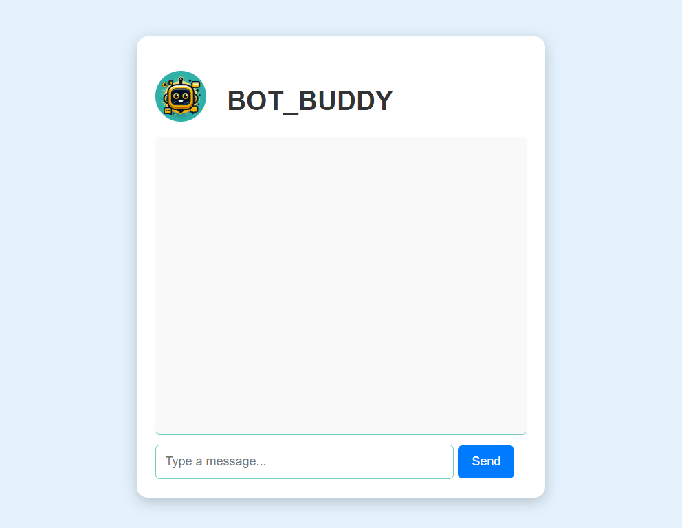

# Bot_Buddy
BOT_BUDDY AI

# 🤖 Bot Buddy - AI Chatbot  

Bot Buddy is an AI-powered chatbot that understands user intent and responds accordingly using **Machine Learning (ML)** and **Google Gemini AI**.

## ✨ Features
✔️ **Intent-based responses** using a trained ML model  
✔️ **AI-generated responses** using Google Gemini API  
✔️ **Interactive chatbot UI** built with Flask & JavaScript  
✔️ **User-friendly design** with modern UI elements  
✔️ **Fast and scalable** backend using Python Flask  
✔️ **Easy deployment** on cloud platforms  


## 📥 Installation
1. **Clone the Repository**  
   ```sh
   git clone https://github.com/ADARILAHARI/Bot_Buddy.git
   cd Bot_Buddy
 ## after clone the data and running the code you may find out the resulatant 

🖼 Screenshots
Here are some previews of the Bot Buddy chatbot in action:

💬 Chatbot UI


💬 Chatbot UI if you want to run in local host you can run the code in your local machine and you can see the chatbot UI in your local host page and reponse will be in the console


 # 👨‍💻 Contributors & Contact Info
Developed by @ADARILAHARI

🔗 GitHub: @ADARILAHARI
📧 Email: adarilahari79@.com